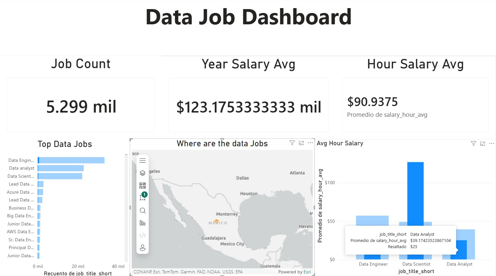
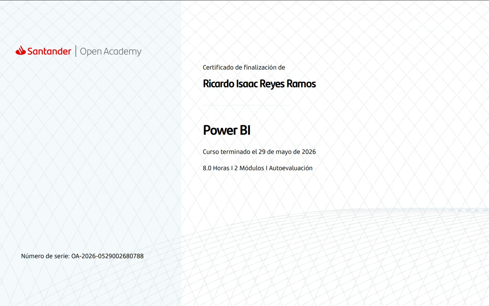

# Dashboard de Data Jobs en Power BI

Este dashboard analiza **la oferta laboral para carreras relacionadas con datos** con el objetivo de responder: *¿En que países hay mayor oferta y mejores salarios?*

## Contexto

Desarrollé este proyecto como parte de mi formación en Ingeniería en Datos e Inteligencia Organizacional, por parte de un curso de Santander Open Academy.

## Qué muestra

- **Job Count:** Número de empleos según el filtro que se aplique en el dashboard.
- **Year Salary Avg:** Promedio de salario Anual según el filtro que se aplique en el dashboard.
- **Hour Salary Avg:** Promedio de salario por hora según el filtro que se aplique en el dashboard.
- **Top Data Jobs:** Los puestos con mayor demanda, al seleccionar un puesto, se puede ver en que países hay mayor oferta y su salario.
- **Where are the data jobs:** Ubicación de los puestos en el mapa.
- **Avg Hour Salary:** Permite ver dependiendo de la ubicación seleccionada, el promedio de salario por hora dependiendo del tipo de empleo.

## Cómo lo construí

1. Importé los datos a Power BI.
2. Organicé la información para trabajar con ella.
3. Creé las visualizaciones y los indicadores principales.
4. Diseñé el tablero para que se pueda leer de un vistazo.

## Lo que aprendí

Este proyecto me ayudó a practicar cómo pasar de datos en bruto a una visualización clara, y a pensar en quién va a leer el dashboard antes de diseñarlo.

## Herramientas

